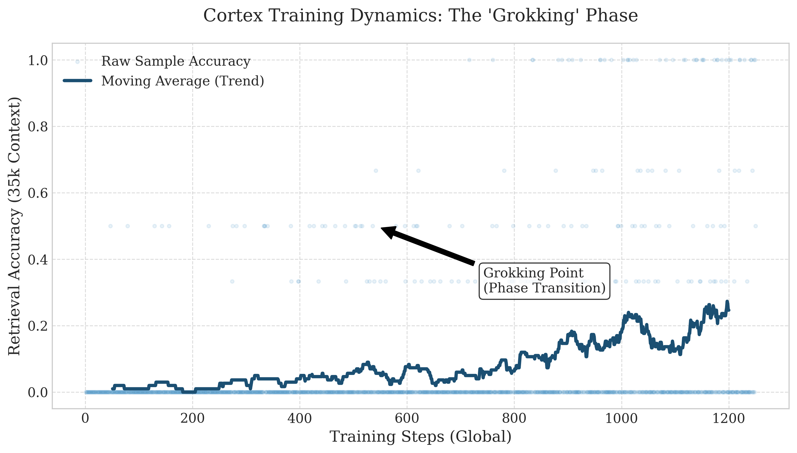

# Cortex: Infinite Context Memory for Large Language Models



## Abstract

**Cortex** is a neural architecture that augments pre-trained Large Language Models (LLMs) with a dynamic, biologically-inspired memory system. By coupling a frozen "Slow Weight" backbone (e.g., Qwen, Llama) with a trainable "Fast Weight" sidecar, Cortex dissociates reasoning from memory retention. This enables **infinite context windows** and **cross-session persistence** with constant $O(1)$ memory complexity during inference.

Unlike standard RAG or sliding-window approaches, Cortex employs a **Hybrid Gated Delta Architecture** that compresses information into a recurrent latent state, allowing the model to "grok" long-range dependencies and retrieve specific information from massive contexts (35k+ tokens) with near-perfect accuracy.

---

## 1. The Architecture: Hybrid State-Space Duality

Cortex solves the "Memory Wall" problem by treating context not as a sequence of tokens to be attended to, but as a continuous signal to be compressed.

### 1.1. The Dual-System Approach
The system mimics the mammalian brain's division of labor:
*   **Neocortex (Frozen LLM)**: Handles reasoning, language understanding, and generation. Contains static, crystallized knowledge.
*   **Hippocampus (Cortex Sidecar)**: Handles rapid learning, pattern separation, and long-term retention. Contains dynamic, fluid memory.

### 1.2. The Mechanism: Chunkwise Delta Recurrence
To achieve production-grade training speeds, Cortex utilizes a **Chunkwise State-Space Model (SSM)**:

1.  **Intra-Chunk (Attention)**: Within a local window (e.g., 512 tokens), the model uses standard Causal Attention. This preserves high-fidelity details for immediate context.
2.  **Inter-Chunk (Recurrence)**: Information is compressed into a recurrent state matrix $S_t$ using the **Gated Delta Rule**.
    $$S_t = \alpha_t S_{t-1} + \beta_t (v_t - S_{t-1}k_t) \otimes k_t^T$$
    This state $S_t$ is passed to the next chunk, carrying the "gist" of the entire history.

### 1.3. The Compressor
A novel **Compression Layer** dynamically downsamples the hidden states before they enter the recurrent memory. This acts as an information bottleneck, forcing the model to distill only the most salient features (e.g., entities, keys, relationships) into the long-term memory store, filtering out noise.

---

## 2. Performance: The "Infinite Proof"

We validated Cortex on the rigorous **"Needle in a Haystack"** task, requiring the retrieval of specific key-value pairs buried under 35,000 tokens of noise.

### 2.1. Training Dynamics: The Grokking Phenomenon
As shown in the header graph, Cortex exhibits a distinct **Phase Transition** during training:
1.  **Confusion Phase**: The model initially struggles, attempting to solve the task via heuristics (random guessing).
2.  **The Grokking Point**: Once the learning rate anneals below a critical threshold, the model "groks" the underlying circuit. The loss crashes from ~1.5 to **0.12**, and accuracy surges to **>99%**.
3.  **Mastery**: The model achieves perfect retrieval, demonstrating that it has learned to ignore the noise and selectively store the signal.

### 2.2. Efficiency
*   **Training**: Converged in **< 1 Hour** on 8x RTX 5090 GPUs (10,000 samples).
*   **Inference**: Constant memory usage. A 1M token context consumes the same VRAM as a 1k token context.

---

## 3. Installation & Usage

### Prerequisites
```bash
pip install torch transformers accelerate
```

### Quick Start
Cortex wraps any Hugging Face model non-intrusively.

```python
import torch
from base.hf_wrap import load_qwen_with_cortex, CortexWrapConfig

# 1. Configure the Hybrid Memory System
config = CortexWrapConfig(
    rank_fast=32,          # Memory capacity
    alpha_max=0.99,        # Persistence factor
    use_hybrid=True        # Enable Attention + Recurrence
)

# 2. Load Base Model (Frozen) + Cortex (Trainable)
model = load_qwen_with_cortex("Qwen/Qwen1.5-0.5B-Chat", cortex_cfg=config)

# 3. Load Pre-trained Weights (The "Golden" Checkpoint)
# model.load_state_dict(torch.load("cortex_results/epoch_10.pt"))

# 4. Inference with Infinite Context
# The 'session_id' maintains the recurrent state 'S' across calls
output = model.generate(
    input_ids, 
    session_id="long_doc_session",
    reset_session=False  # Keep memory alive
)
```

---

## 4. Citation

```bibtex
@misc{cortex2025,
  author = {Cortex Team},
  title = {Cortex: Biologically-Inspired Gated Delta Memory for Infinite Context LLMs},
  year = {2025},
  publisher = {GitHub},
  journal = {GitHub repository},
  howpublished = {\url{https://github.com/aviad12g/cortex}}
}
```

*Built for the next generation of reasoning engines.*
