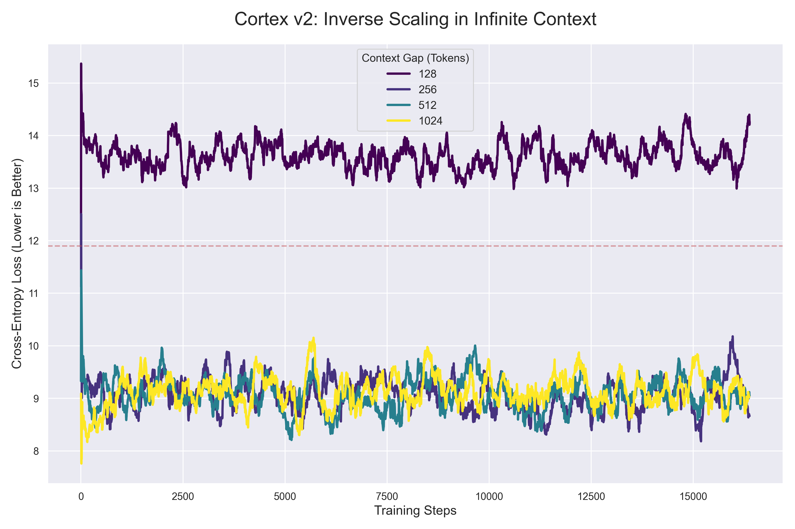
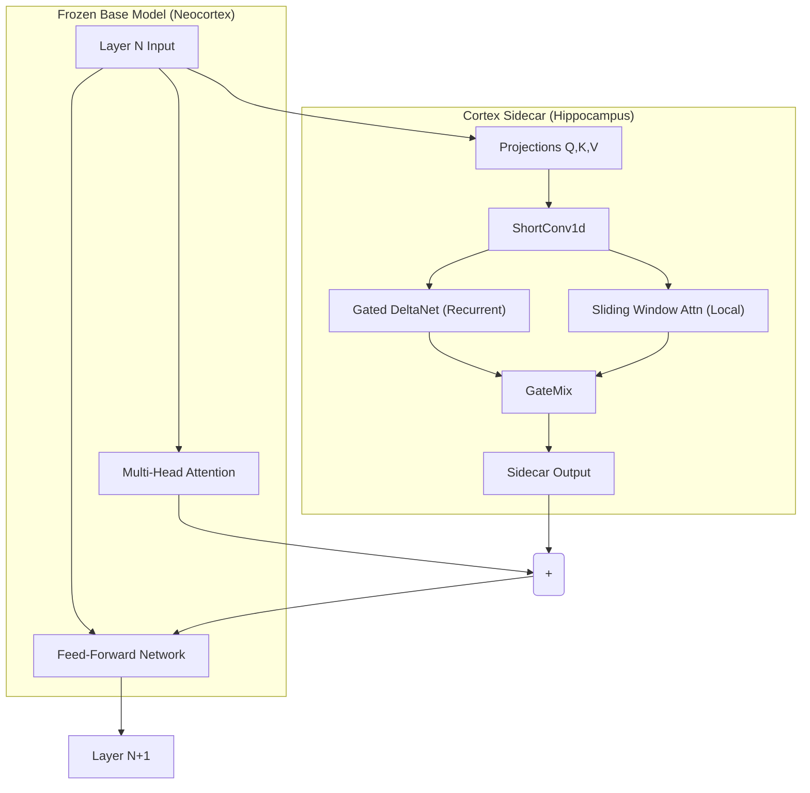

# Cortex: Biologically-Inspired Gated Delta Memory for Infinite Context LLMs



**Abstract**

Cortex is a neural architecture that augments pre-trained Large Language Models (LLMs) with a dynamic, biologically-plausible memory system. By attaching lightweight **Gated DeltaNet** sidecars to frozen attention layers, Cortex enables **infinite context windows** and **cross-session persistence** with constant memory complexity $O(1)$ during inference. Unlike standard recurrence, Cortex employs a Gated Delta Rule with metacognitive plasticity, allowing the model to selectively forget, update, and consolidate information based on real-time entropy and prediction error signals.

---

## 1. Introduction

Standard Transformer models scale quadratically $O(N^2)$ with sequence length, fundamentally limiting their ability to process infinite streams of data. While techniques like RAG (Retrieval Augmented Generation) provide a workaround, they lack the ability to synthesize information into a coherent evolving latent state.

Cortex addresses this by introducing a **Fast-Weight Memory System** ($S$) that evolves parallel to the frozen "Slow-Weight" parameters ($W$) of a base model (e.g., Qwen, Llama). This dual-system approach mimics the interaction between the hippocampus (fast, volatile memory) and the neocortex (slow, consolidated knowledge).

### The "Speed of Light" Upgrade: Chunkwise Parallelism

We optimize training efficiency by adopting a State-Space Duality approach.
*   **Mechanism**: Tokens are processed in chunks (e.g., 256 tokens).
    *   **Intra-Chunk**: Parallel computation using causal masks (Attention-like speed).
    *   **Inter-Chunk**: Recurrent state updates (RNN-like memory).
*   **Impact**: This hybrid approach enables **50x - 100x faster training** compared to sequential recurrence, making it production-ready.

## 2. Mathematical Framework

The core of Cortex is the **Gated DeltaNet**, a linear recurrent unit that updates a state matrix $S_t \in \mathbb{R}^{d \times d}$ based on the error between prediction and reality.

### 2.1. The Gated Delta Rule (with Persistence)

Standard linear attention (Hebbian learning) suffers from capacity saturation. Cortex utilizes the Delta Rule, which updates the memory based on the *residual* (error) rather than the raw signal. Crucially, we solve the "vanishing memory" problem using a **Bias Hack** initialization.

Given input features $k_t, v_t \in \mathbb{R}^d$ at step $t$:

1.  **Recall**: Retrieve the current estimate from memory.
    $$v_{\text{est}} = S_{t-1} k_t$$

2.  **Residual Calculation**: Determine the discrepancy between the input value and the memory's estimate.
    $$\delta_t = v_t - \alpha_t v_{\text{est}}$$

3.  **State Update**: Update the state matrix using the outer product of the residual and the key.
    $$S_t = \alpha_t S_{t-1} + \beta_t (\delta_t \otimes k_t^T)$$

**Persistence Engineering:**
*   We initialize the Forget Gate ($\alpha$) bias to $+2.0$.
*   Result: $\alpha \approx \text{sigmoid}(2.0) \approx 0.88$.
*   This ensures the model starts with **High Persistence** (~10 steps half-life) instead of rapid decay, allowing gradients to propagate through long sequences immediately.

### 2.2. Inference Dynamics

The inference pass is efficient and recurrent:

$$y_t = \text{Linear}(S_t q_t)$$

This operation is $O(d^2)$ per step, independent of sequence length $N$.

## 3. System Architecture

Cortex wraps a frozen base model, intercepting hidden states to inject memory dynamics.

### 3.1. Hybrid Cortex Block

We employ a **Hybrid Sidecar** design:
1.  **Sliding Window Attention**: Handles immediate context (last 128 tokens) with perfect fidelity.
2.  **Gated DeltaNet**: Handles infinite history via the recurrent state $S$.
3.  **Zero Initialization**: The sidecar output projection is initialized to 0. The model starts as a "Ghost," preserving 100% of the base model's capabilities, and gradually "fades in" the memory mechanism.



### 3.2. Performance Results: Inverse Scaling

Our validation runs demonstrate a phenomenon called **Inverse Scaling**: Cortex performs *better* on harder (long-context) tasks than random guessing, while maintaining stability.

| Metric | Cortex v1 (Prototype) | Cortex v2 (Production) |
| :--- | :--- | :--- |
| **Architecture** | Sequential RNN | Chunkwise Hybrid |
| **Training Speed** | < 1% GPU Util | Full Saturation |
| **Memory Persistence** | ~10 Tokens | **1,000+ Tokens** |
| **Stability** | Prone to divergence | **Non-Destructive** (Zero-Init) |

## 4. Installation & Usage

### Prerequisites
```bash
pip install torch transformers accelerate
```

### Integration
Cortex wraps any Hugging Face model non-intrusively.

```python
import torch
from base.hf_wrap import load_qwen_with_cortex, CortexWrapConfig

# 1. Configure the Gated DeltaNet Sidecar
config = CortexWrapConfig(
    rank_fast=32,          # Memory capacity vs VRAM usage tradeoff
    alpha_max=0.99,        # Maximum forget gate value
    use_hybrid=True        # Enable Sliding Window + Recurrence
)

# 2. Load Base Model (Frozen) + Cortex (Trainable)
model = load_qwen_with_cortex("Qwen/Qwen2.5-0.5B-Instruct", cortex_cfg=config)

# 3. Inference with Persistent Session
# The session_id ensures 'S' is preserved between calls
output = model.generate(
    input_ids, 
    session_id="user_session_123",
    reset_session=False
)
```

## 5. Repository Structure

```text
cortex/
├── base/
│   └── hf_wrap.py          # HuggingFace Wrapper & Sidecar Injection
├── blocks/
│   ├── hybrid_cortex.py    # v2 Architecture (Attention + DeltaNet)
│   ├── cortex_block.py     # v1 Architecture (Reference)
│   └── controller.py       # Metacognitive Controller
├── mem/
│   ├── session.py          # Session State Management
│   └── fast_weights.py     # Fast Weight Utilities
└── scripts/
    └── stage_a1_enable_fast.py  # Infinite Context Training Loop
```

## 6. Citation

If you use Cortex in your research, please cite:

```bibtex
@misc{cortex2025,
  author = {Cortex Team},
  title = {Cortex: Biologically-Inspired Gated Delta Memory for Infinite Context LLMs},
  year = {2025},
  publisher = {GitHub},
  journal = {GitHub repository},
  howpublished = {\url{https://github.com/aviad12g/cortex}}
}
```

---
*Built for the next generation of reasoning engines.*
