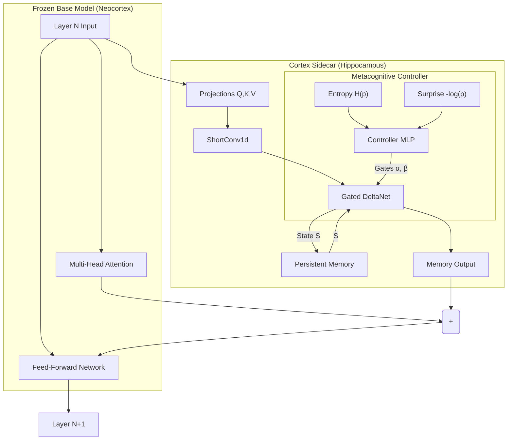
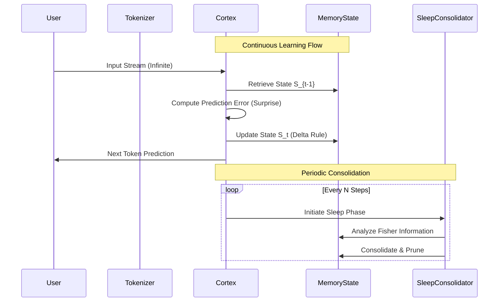
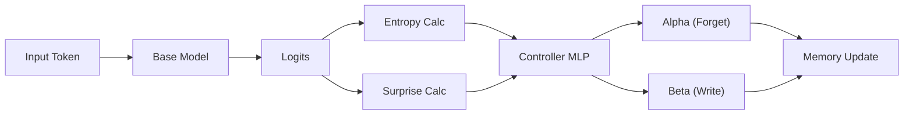

# Cortex: Biologically-Inspired Gated Delta Memory for Infinite Context LLMs

**Abstract**

Cortex is a neural architecture that augments pre-trained Large Language Models (LLMs) with a dynamic, biologically-plausible memory system. By attaching lightweight **Gated DeltaNet** sidecars to frozen attention layers, Cortex enables **infinite context windows** and **cross-session persistence** with constant memory complexity $O(1)$ during inference. Unlike standard recurrence, Cortex employs a Gated Delta Rule with metacognitive plasticity, allowing the model to selectively forget, update, and consolidate information based on real-time entropy and prediction error signals.

---

## 1. Introduction

Standard Transformer models scale quadratically $O(N^2)$ with sequence length, fundamentally limiting their ability to process infinite streams of data. While techniques like RAG (Retrieval Augmented Generation) provide a workaround, they lack the ability to synthesize information into a coherent evolving latent state.

Cortex addresses this by introducing a **Fast-Weight Memory System** ($S$) that evolves parallel to the frozen "Slow-Weight" parameters ($W$) of a base model (e.g., Qwen, Llama). This dual-system approach mimics the interaction between the hippocampus (fast, volatile memory) and the neocortex (slow, consolidated knowledge).

## 2. Mathematical Framework

The core of Cortex is the **Gated DeltaNet**, a linear recurrent unit that updates a state matrix $S_t \in \mathbb{R}^{d \times d}$ based on the error between prediction and reality.

### 2.1. The Gated Delta Rule

Standard linear attention (Hebbian learning) suffers from capacity saturation. Cortex utilizes the Delta Rule, which updates the memory based on the *residual* (error) rather than the raw signal.

Given input features $k_t, v_t \in \mathbb{R}^d$ at step $t$:

1.  **Recall**: Retrieve the current estimate from memory.
    $$v_{\text{est}} = S_{t-1} k_t$$

2.  **Residual Calculation**: Determine the discrepancy between the input value and the memory's estimate.
    $$\delta_t = v_t - \alpha_t v_{\text{est}}$$

3.  **State Update**: Update the state matrix using the outer product of the residual and the key.
    $$S_t = \alpha_t S_{t-1} + \beta_t (\delta_t \otimes k_t^T)$$

Where:
*   $\alpha_t \in [0, 1]$ is the **Forget Gate** (how much history to retain).
*   $\beta_t \in \mathbb{R}^+$ is the **Write Gate** (learning rate intensity).

### 2.2. Inference Dynamics

The inference pass is efficient and recurrent:

$$y_t = \text{Linear}(S_t q_t)$$

This operation is $O(d^2)$ per step, independent of sequence length $N$.

## 3. System Architecture

Cortex wraps a frozen base model, intercepting hidden states to inject memory dynamics.

### 3.1. Component Diagram



### 3.2. Information Flow: Training vs. Inference



### 3.3. Architectural Innovations

1.  **Short Convolution**: A depthwise `Conv1d` (kernel size 3) processes $q, k, v$ before they enter the recurrent state. This captures local n-gram dependencies that linear RNNs typically miss.
2.  **L2 Normalization**: Keys $k_t$ are L2-normalized, ensuring the eigenvalues of the recurrent matrix remain stable, preventing the "exploding gradient" problem common in RNNs.
3.  **Metacognitive Plasticity**: A lightweight controller monitors the base model's **Entropy** (uncertainty) and **Surprise** (loss).
    *   *High Surprise*: Increases $\beta$ (write rate) to correct the error.
    *   *High Entropy*: Modulates $\alpha$ to stabilize memory during confusing segments.

### 3.4. Metacognitive Gating Visualization



## 4. Training Methodology

Cortex employs a multi-stage training regime designed for infinite context.

### 4.1. Truncated Backpropagation Through Time (TBPTT)
We train on sequences of unlimited length by splitting them into chunks (e.g., 512 tokens).
*   **Forward**: Gradients are computed within the chunk.
*   **State Persistence**: The final state $S_T$ of chunk $i$ becomes the initial state $S_0$ of chunk $i+1$.
*   **Backward**: Gradients are detached between chunks to bound memory usage, while the forward pass propagates information indefinitely.

### 4.2. Sleep & Consolidation
To prevent catastrophic forgetting of long-term data, Cortex enters a "Sleep Phase" every $N$ steps.
1.  **Dreaming**: The model generates noise or replays buffered tokens.
2.  **Fisher Information**: We calculate the Fisher Information Matrix (FIM) to identify critical weights in $S$.
3.  **Consolidation**: A regularization term penalizes changes to these critical weights during subsequent training, effectively "solidifying" memories.

## 5. Complexity Analysis

Comparison between Standard Attention (Transformer) and Cortex (Gated DeltaNet).

| Metric | Standard Attention | Cortex Memory |
| :--- | :--- | :--- |
| **Training Compute** | $O(N^2)$ | $O(N)$ |
| **Inference Memory** | $O(N)$ (KV Cache) | $O(1)$ (Fixed State $S$) |
| **Inference Latency** | $O(N)$ (Prefill) | $O(1)$ (Step) |
| **Context Length** | Finite (Window Size) | Infinite (Recurrent) |

## 6. Installation & Usage

### Prerequisites
```bash
pip install torch transformers accelerate
```

### Integration
Cortex wraps any Hugging Face model non-intrusively.

```python
import torch
from base.hf_wrap import load_qwen_with_cortex, CortexWrapConfig

# 1. Configure the Gated DeltaNet Sidecar
config = CortexWrapConfig(
    rank_fast=64,          # Dimension of memory state
    alpha_max=0.99,        # Maximum forget gate value
    use_short_conv=True,   # Enable local context convolution
    meta_plasticity=True   # Enable entropy-based gating
)

# 2. Load Base Model (Frozen) + Cortex (Trainable)
model = load_qwen_with_cortex("Qwen/Qwen2.5-0.5B-Instruct", cortex_cfg=config)

# 3. Inference with Persistent Session
# The session_id ensures 'S' is preserved between calls
output = model.generate(
    input_ids, 
    session_id="user_session_123",
    reset_session=False
)
```

## 7. Repository Structure

```text
cortex/
├── base/
│   └── hf_wrap.py          # HuggingFace Wrapper & Sidecar Injection
├── blocks/
│   ├── cortex_block.py     # Gated DeltaNet Implementation
│   └── controller.py       # Metacognitive Controller (Entropy/Surprise)
├── mem/
│   ├── session.py          # Session State Management
│   ├── consolidation.py    # Sleep & Fisher Information Logic
│   └── fast_weights.py     # Fast Weight Utilities
└── scripts/
    └── stage_a1_enable_fast.py  # Infinite Context Training Loop
```

## 8. Citation

If you use Cortex in your research, please cite:

```bibtex
@misc{cortex2025,
  author = {Cortex Team},
  title = {Cortex: Biologically-Inspired Gated Delta Memory for Infinite Context LLMs},
  year = {2025},
  publisher = {GitHub},
  journal = {GitHub repository},
  howpublished = {\url{https://github.com/aviad12g/cortex}}
}
```

---
*Built for the next generation of reasoning engines.*
