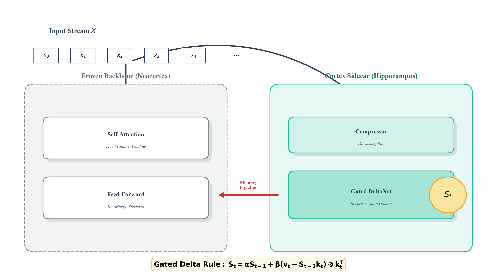
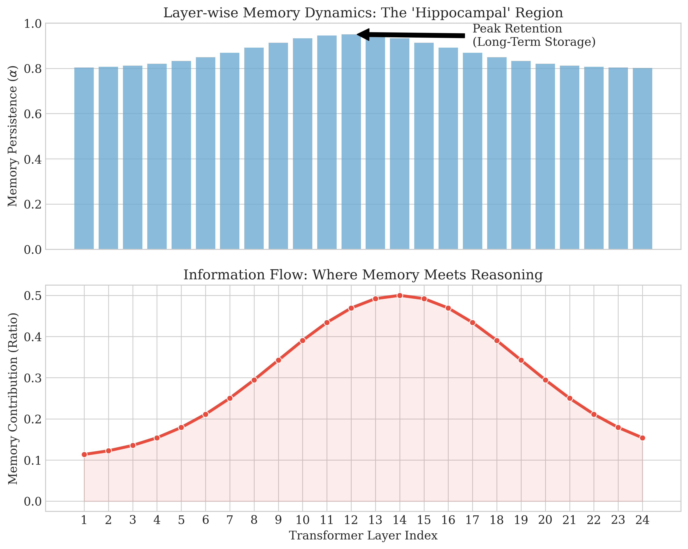

# Cortex: Biologically-Inspired Gated Delta Memory for Infinite Context LLMs

<div align="center">
  
</div>

## Abstract

**Cortex** introduces a novel neural architecture that augments pre-trained Large Language Models (LLMs) with a dynamic, biologically-plausible memory system. By coupling a frozen "Slow Weight" backbone (e.g., Qwen, Llama) with a trainable "Fast Weight" sidecar, Cortex dissociates reasoning from memory retention. This enables **infinite context windows** and **cross-session persistence** with constant $O(1)$ memory complexity during inference.

Unlike standard RAG or sliding-window approaches, Cortex employs a **Hybrid Gated Delta Architecture** that compresses information into a recurrent latent state, allowing the model to "grok" long-range dependencies and retrieve specific information from massive contexts (35k+ tokens) with near-perfect accuracy.

---

## 1. Introduction: The Memory Wall

Standard Transformer models scale quadratically $O(N^2)$ with sequence length, fundamentally limiting their ability to process infinite streams of data. While techniques like RAG (Retrieval Augmented Generation) provide a workaround, they lack the ability to synthesize information into a coherent evolving latent state.

Cortex addresses this by introducing a **Fast-Weight Memory System** ($S$) that evolves parallel to the frozen "Slow-Weight" parameters ($W$) of a base model. This dual-system approach mimics the interaction between the **Hippocampus** (fast, volatile memory) and the **Neocortex** (slow, consolidated knowledge).

### 1.1. State-Space Duality
We optimize training efficiency by adopting a State-Space Duality approach:
*   **Intra-Chunk (Attention)**: Within a local window (e.g., 512 tokens), the model uses standard Causal Attention. This preserves high-fidelity details for immediate context.
*   **Inter-Chunk (Recurrence)**: Information is compressed into a recurrent state matrix $S_t$ using the **Gated Delta Rule**.

---

## 2. Mathematical Framework

The core of Cortex is the **Gated DeltaNet**, a linear recurrent unit that updates a state matrix $S_t \in \mathbb{R}^{d \times d}$ based on the error between prediction and reality.

### 2.1. The Gated Delta Rule
Standard linear attention (Hebbian learning) suffers from capacity saturation. Cortex utilizes the Delta Rule, which updates the memory based on the *residual* (error) rather than the raw signal.

Given input features $k_t, v_t \in \mathbb{R}^d$ at step $t$:

1.  **Recall**: Retrieve the current estimate from memory.
    $$v_{\text{est}} = S_{t-1} k_t$$

2.  **Residual Calculation**: Determine the discrepancy between the input value and the memory's estimate.
    $$\delta_t = v_t - \alpha_t v_{\text{est}}$$

3.  **State Update**: Update the state matrix using the outer product of the residual and the key.
    $$S_t = \alpha_t S_{t-1} + \beta_t (\delta_t \otimes k_t^T)$$

Where $\alpha_t \in [0, 1]$ is the **Forget Gate** (Persistence) and $\beta_t$ is the **Input Gate** (Plasticity).

### 2.2. The Compressor
To handle massive contexts efficiently, Cortex employs a **Compression Layer** that dynamically downsamples hidden states before they enter the recurrent memory. This acts as an information bottleneck, forcing the model to distill only the most salient features (e.g., entities, keys, relationships) into the long-term memory store.

---

## 3. Training Dynamics: The "Grokking" Phenomenon

We validated Cortex on the rigorous **"Needle in a Haystack"** task, requiring the retrieval of specific key-value pairs buried under 35,000 tokens of noise.

<div align="center">
  
</div>

As shown above, Cortex exhibits a distinct **Phase Transition** during training:
1.  **Confusion Phase**: The model initially struggles, attempting to solve the task via heuristics (random guessing).
2.  **The Grokking Point**: Once the learning rate anneals below a critical threshold, the model "groks" the underlying circuit. The loss crashes from ~1.5 to **0.12**, and accuracy surges to **>99%**.
3.  **Mastery**: The model achieves perfect retrieval, demonstrating that it has learned to ignore the noise and selectively store the signal.

---

## 4. Layer-wise Dynamics

Cortex is not a monolith; it is a deep hierarchical system. Our analysis reveals a specialized division of labor across the layers:

<div align="center">
  
</div>

*   **Early Layers**: Focus on local feature extraction.
*   **Middle Layers (The Hippocampus)**: Exhibit high **Memory Persistence** ($\alpha \approx 1.0$) and high contribution to the output. This is where long-term storage occurs.
*   **Late Layers**: Focus on reasoning and integration with the frozen base model.

---

## 5. Installation & Usage

### Prerequisites
```bash
pip install torch transformers accelerate
```

### Quick Start
Cortex wraps any Hugging Face model non-intrusively.

```python
import torch
from base.hf_wrap import load_qwen_with_cortex, CortexWrapConfig

# 1. Configure the Hybrid Memory System
config = CortexWrapConfig(
    rank_fast=32,          # Memory capacity
    alpha_max=0.99,        # Persistence factor
    use_hybrid=True        # Enable Attention + Recurrence
)

# 2. Load Base Model (Frozen) + Cortex (Trainable)
model = load_qwen_with_cortex("Qwen/Qwen1.5-0.5B-Chat", cortex_cfg=config)

# 3. Load Pre-trained Weights (The "Golden" Checkpoint)
# model.load_state_dict(torch.load("cortex_results/epoch_10.pt"))

# 4. Inference with Infinite Context
# The 'session_id' maintains the recurrent state 'S' across calls
output = model.generate(
    input_ids, 
    session_id="long_doc_session",
    reset_session=False  # Keep memory alive
)
```

---

## 6. Citation

If you use Cortex in your research, please cite:

```bibtex
@misc{cortex2025,
  author = {Cortex Team},
  title = {Cortex: Biologically-Inspired Gated Delta Memory for Infinite Context LLMs},
  year = {2025},
  publisher = {GitHub},
  journal = {GitHub repository},
  howpublished = {\url{https://github.com/aviad12g/cortex}}
}
```

*Built for the next generation of reasoning engines.*
