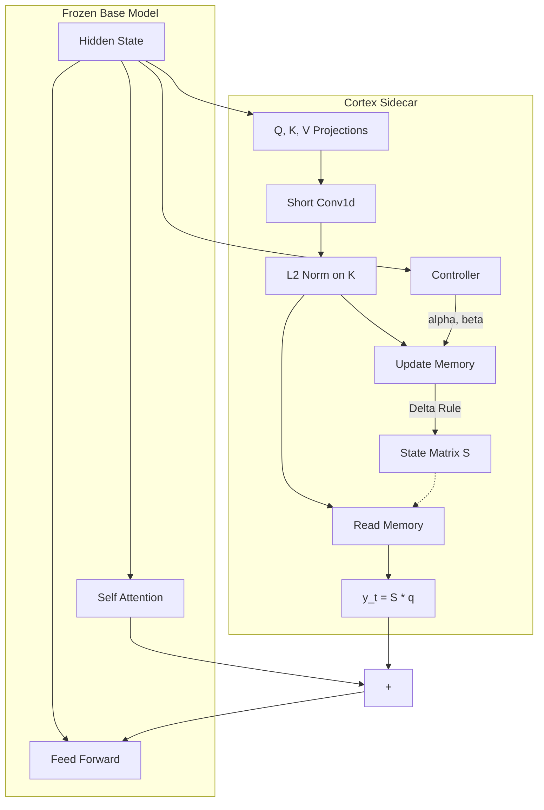

# Cortex: Biologically-Inspired Gated Delta Memory

Cortex augments frozen Large Language Models with a trainable, biologically-plausible memory system. It enables **infinite context windows** and **persistent memory** across sessions without modifying the base model's weights.

By attaching a lightweight **Gated DeltaNet** sidecar to every attention layer, Cortex allows the model to "write" to a fast-weight matrix $S$ during inference. This memory is dynamic: it decays, updates based on prediction error (surprise), and consolidates important information during "sleep" phases.

## Core Architecture

### 1. The Gated DeltaNet Sidecar
Instead of standard attention ($O(N^2)$), Cortex uses a linear recurrent formulation ($O(N)$) based on the **Gated Delta Rule**. This allows it to maintain a fixed-size state $S$ regardless of sequence length.

**Mathematical Formulation:**

Let $x_t$ be the input at step $t$. We project it to queries, keys, and values:
$$q_t, k_t, v_t = \text{Proj}(x_t)$$

To capture local context before long-term storage, we apply a short depthwise convolution:
$$q'_t, k'_t, v'_t = \text{ShortConv1d}(q_t, k_t, v_t)$$

The memory state $S_t \in \mathbb{R}^{d \times d}$ is updated using a forgetting gate $\alpha_t$ and a writing gate $\beta_t$:

$$ \text{Recall:} \quad v_{\text{old}} = S_{t-1} k'_t $$
$$ \text{Update:} \quad S_t = \alpha_t S_{t-1} + \beta_t (v'_t - \alpha_t v_{\text{old}}) {k'_t}^T $$
$$ \text{Read:} \quad y_t = S_t q'_t $$

*   **$\alpha_t$ (Forget Gate):** Controls how much of the old memory is retained.
*   **$\beta_t$ (Input Gate):** Controls how strongly new information is written.
*   **Delta Rule $(v - S k)$:** We only learn the *error*—the difference between the retrieved value and the new value. This prevents capacity saturation compared to standard Hebbian learning.

### 2. Metacognitive Plasticity
The model learns *how to learn*. A specialized **Controller** network monitors the base model's internal state to modulate the plasticity gates $\alpha$ and $\beta$.

*   **Entropy (Uncertainty):** If the model is unsure (high entropy), it may open the gates to absorb new information.
*   **Surprise (Loss):** High prediction error signals a need to update the memory model to correct the mistake.

$$ [\alpha_t, \beta_t] = \text{Controller}(\text{Entropy}(p_t), \text{Surprise}(y_t), \text{HiddenState}_t) $$

### 3. System Overview



## Key Features

*   **Infinite Context:** Memory cost is constant $O(1)$ regardless of sequence length.
*   **Frozen Base:** The large base model (e.g., Qwen-0.5B, Llama-3) remains untouched. Only the lightweight Cortex parameters (~2% of base) are trained.
*   **Sleep & Consolidation:** A periodic "sleep" phase generates random noise and uses **Fisher Information Matrix (FIM)** regularization to consolidate short-term fast weights into long-term slow weights, preventing catastrophic forgetting.
*   **Truncated BPTT:** Supports training on sequences far exceeding GPU memory by detaching gradients between chunks while persisting the memory state $S$.

## Installation

```bash
pip install torch transformers accelerate
```

## Usage

### Training (Infinite Context Mode)
Train the Cortex sidecars on long sequences with memory persistence and sleep phases.

```bash
python scripts/stage_a1_enable_fast.py \
    --model Qwen/Qwen2.5-0.5B-Instruct \
    --task kv \
    --chunk_size 512 \
    --gaps 2000 4000 \
    --samples_per_gap 256 \
    --fast_rank 64 \
    --lr_sidecar 5e-5
```

### Inference

```python
from base.hf_wrap import load_qwen_with_cortex, CortexWrapConfig

# Load with Gated DeltaNet configuration
config = CortexWrapConfig(
    rank_fast=64,
    alpha_max=0.99,
    use_short_conv=True
)

model = load_qwen_with_cortex("Qwen/Qwen2.5-0.5B-Instruct", cortex_cfg=config)

# Chat with persistent memory
history = []
session_id = "user_session_1"

response = model.generate(
    input_ids, 
    session_id=session_id, # Persists memory state S across calls
    reset_session=False
)
```

## Implementation Details

| Component | Specification |
|-----------|---------------|
| **State Shape** | $[B, H, D_{head}, D_{head}]$ |
| **Update Rule** | Gated Delta Rule (Linear Transformer) |
| **Local Context** | Depthwise Conv1d (kernel=3) |
| **Normalization** | L2 Norm on Keys (crucial for stability) |
| **Gating** | Data-dependent $\alpha, \beta$ (Sigmoid) |

## License
MIT
